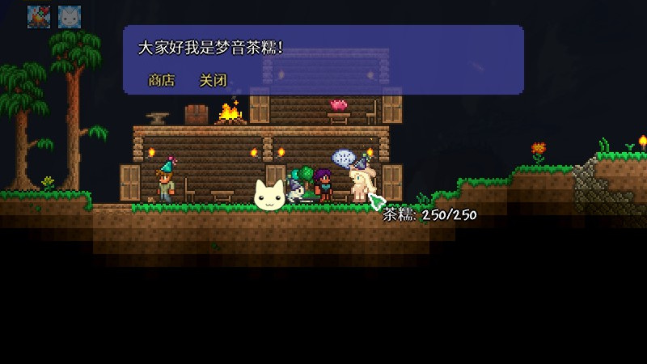

# Terraria-ChanoMod

*Chano Mod implements Yumeoto Chano (梦音茶糯) as a NPC into Terraria world! Also with some items!*



## Play!

Get the newest version of this mod from release.

To spawn Chano the town NPC, make sure there's a basic house, and put a Party Monolith (派对中心) (buy from Party Girl) inside, then wait between morning and noon.

Chano's stuffs are mainly focused on curing, i.e. boost your life regeneration :)

Use command `/chano-next-song` in chat to switch song, if you've equiped a MP3 Player.

## Status

- Chano have initial sprite...
- Initial Yumeoto Candy (梦音糖) & Yumeoto Tea (梦音茶)!
- Initial Accessory Yumeoto Charm (梦音符)!
- Initial Candy & Tea Buff!
- Initial Pet Nono (糯糯)!
- An MP3 Player as vanity accessory!
- A Command for switching songs!
- ...

## Development

This little mod is in early development. Please suggest what to do in issue, if any in your mind.

Textures made with Krita, GIMP & ffmpeg, developed code with Visual Studio 2019.

Steps to compile:

1. Clone the repo
2. **Rename the folder to `ChanoMod`**
3. If you are willing to listen to Yumeoto's songs, get them from somewhere, place into `ChanoMod/Sounds/Music/` then rename them to exactly as in [the list](#song-name-list).
3. Move folder to `Mod Sources` of Terraria (tModLoader), may need to satisfy Developer Mode requirements.
4. Compile the mod in-game
5. Enable the mod and reload

Credits:

- [Terraria](https://terraria.org/)
- [tModLoader](https://github.com/tModLoader/tModLoader)
- [Yumeoto Chano (梦音茶糯)](https://space.bilibili.com/140378) (Bilibili)

Cheers~ ;)

## Song Name List

```csharp
private readonly string[] songs = {
    "梦音Miku - sansettoma-chi",  // サンセットマーチ
    "梦音Miku, 花泽香菜 - sweets parade",
    "梦音Miku - haro-hawayu",     // ハロ／ハワユ
    "梦音Miku - Poker Face",
    "梦音Miku - 芒种-日文版",
    "梦音茶糯 - RingRingRing.mp3",
    "梦音茶糯 - 稻香.mp3",
    "梦音茶糯 - 错位时空",
    "梦音茶糯 - 霞光.mp3"
};
```
